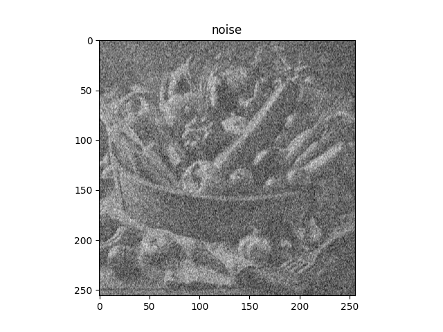
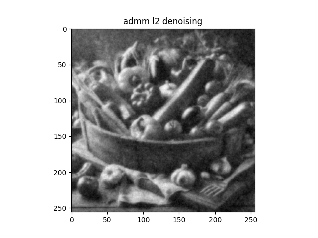

# ADMMによるノイズ除去
- **admm_denoising_l1norm.py**（ノイズ画像から滑らかな画像を推定する（L1ノルム））
   - 元画像をグレースケール変換し、ノイズ付加する。
   - L1正則化を用いて画像を推定する。

  |                      ノイズ画像                      |                             ノイズ除去画像                                   |
  | :--------------------------------------------------: | :--------------------------------------------------------------------------: |
  |  |  |
 
- **admm_denoising_l2norm.py**（ノイズ画像から滑らかな画像を推定する（L2ノルム））
   - 元画像をグレースケール変換し、ノイズ付加する。
   - L2正則化を用いて画像を推定する。

   |                     ノイズ画像                       |                                  ノイズ除去画像                               |
   | :--------------------------------------------------: | :---------------------------------------------------------------------------: |
   |  |   |

- L1正則化に比べて、L2正則化の方が[グレースケール変換した画像](Images/yasai256gray.png)により近くなる。
- L1正則化は輪郭成分を保持しているが、スパース性を促進するため、画像の微細な特徴が失われる可能性があります。
  したがって、ノイズ除去画像がぼやけてしまう。