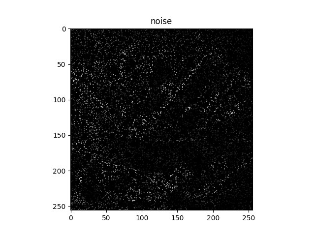
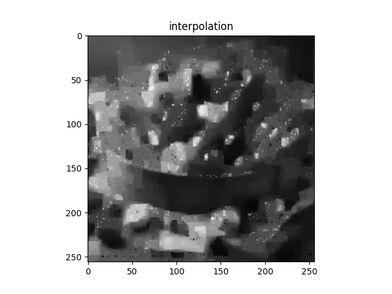
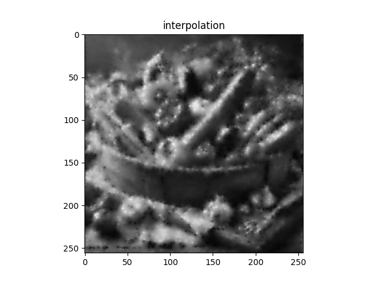

# ADMMによる欠損画素補間
- **admm_denoising_l1norm.py**（欠損画像から滑らかな画像を推定する（L1ノルム））
   - 元画像をグレースケール変換し、ノイズ付加する。
   - L1正則化を用いて画像を推定する。

  |                      欠損画像                              |                             欠損画素補完画像                                                 |
  | :--------------------------------------------------------: | :------------------------------------------------------------------------------------------: |
  |  |  |
 
- **admm_denoising_l2norm.py**（欠損画像から滑らかな画像を推定する（L2ノルム））
   - 元画像をグレースケール変換し、ノイズ付加する。
   - L2正則化を用いて画像を推定する。

  |                     欠損画像                               |                                  欠損画素補完画像                                            |
  | :--------------------------------------------------------: | :------------------------------------------------------------------------------------------: |
  |  |  |

- L1正則化に比べて、L2正則化の方が[グレースケール変換した画像](Images/yasai256gray.png)により近くなる。
- L2正則化は、モデルの重みをなめらかにする傾向がある。
  これにより、近傍の画素の情報を適切に利用して補間することができる。
- 一方で、L1正則化はスパース性を促進するため、重みの一部が厳密にゼロになる可能性がある。
  これが補間の品質を低下させる可能性がある。