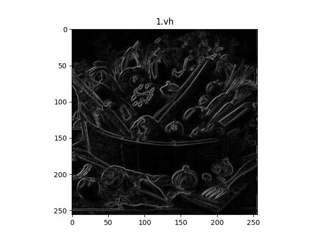
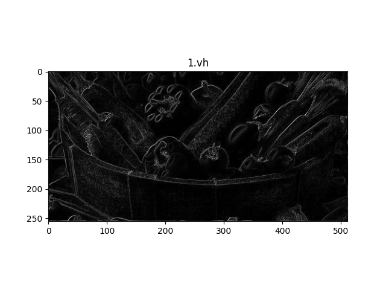

# エッジ検出
  - **diff_filter.py**（正方形のみの画像のエッジ検出）
    - グレースケール変換してからエッジ検出する。

  | roll 関数で周期シフトして垂直水平の両方向のエッジ検出 | 線形代数を使って垂直水平の両方向のエッジ検出     |
  | :---------------------------------------------------: | :----------------------------------------------: |
  |       |  |

  - **diff_filter2.py**（長方形を含む画像のエッジ検出）
    - diff_filter2 は diff_filter の改良版
    - 正方形と長方形の画像に対応している。

  | roll 関数で周期シフトして垂直水平の両方向のエッジ検出 | 線形代数を使って垂直水平の両方向のエッジ検出     |
  | :---------------------------------------------------: | :----------------------------------------------: |
  |       |  |

- 1.vh と 2.vh は違う手法だが、出力画像は同じになる。(1.vh と 2.vh の誤差はゼロ)