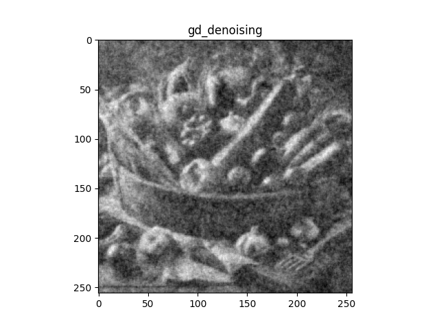

# 最小二乗法によるノイズ除去  
 - **denoising_differential_l2norm.py**（最小二乗法によるノイズ除去（微分係数 = 0 で解く））
   - 元画像をグレースケール変換し、ノイズ付加する。
   - ノイズ付加画像から解析的な解を求める。

   |                     ノイズ画像                       |                                     ノイズ除去画像                                      |
   | :--------------------------------------------------: | :-------------------------------------------------------------------------------------: |
   |  |   |

 - **denoising_gd_l2norm.py**（最小二乗法によるノイズ除去（最急降下法で解く））
   - 元画像をグレースケール変換し、ノイズ付加する。
   - ノイズ付加画像から反復的な数値計算により解を求める。

  |                      ノイズ画像                      |                                     ノイズ除去画像                 |
  | :--------------------------------------------------: | :----------------------------------------------------------------: |
  |  |  |

 - (i) 「微分係数 = 0 で解く手法」と(ii) 「最急降下法で解く手法」の誤差はほぼゼロに近い。
 - (i) は逆行列計算があり、計算コストが高いので大きい画像は (ii) が適している。