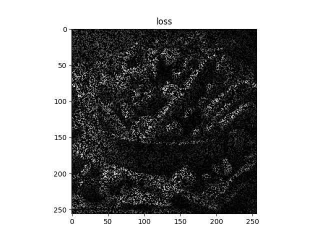
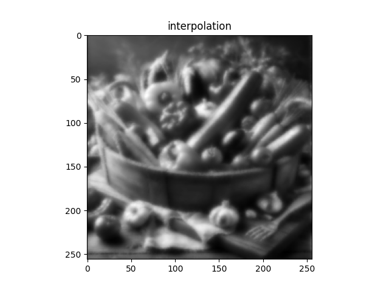

# 最小二乗法による欠損画素補間
  - **interpolation_differential_l2norm.py**（最小二乗法による欠損画素補間（微分係数 = 0 で解く））
    - 元画像をグレースケール変換し、欠損を付加する。
    - 欠損付加画像から解析的な解を求める。

    |                        欠損画像                    |                                     欠損補間画像                                                |
    | :------------------------------------------------: | :---------------------------------------------------------------------------------------------: |
    |  |   |

  - **interpolation_gd_l2norm.py**（最小二乗法による欠損画素補間（最急降下法で解く））
    - 元画像をグレースケール変換し、欠損を付加する。
    - 欠損付加画像から反復的な数値計算により解を求める。

    |                        欠損画像                    |                                     欠損補間画像                           |
    | :------------------------------------------------: | :------------------------------------------------------------------------: |
    |  |  |
  
  - (i) 「微分係数 = 0 で解く手法」と(ii) 「最急降下法で解く手法」の誤差はほぼゼロに近い。
  - (i) は逆行列計算があり、計算コストが高いので大きい画像は (ii) が適している。