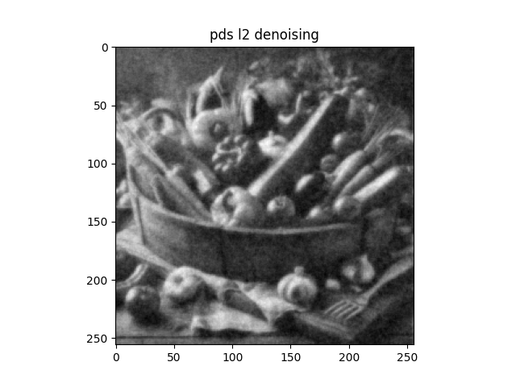
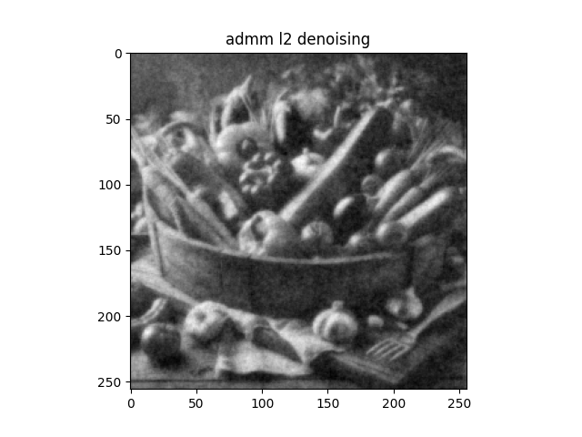

# PDSによるノイズ除去
- **pds_denoising_l1norm.py**（ノイズ画像から滑らかな画像を推定する（L1ノルム））
   - 元画像をグレースケール変換し、ノイズ付加する。
   - L1正則化を用いて画像を推定する。

  |                      ノイズ画像                      |                             ノイズ除去画像                                                   |
  | :--------------------------------------------------: | :------------------------------------------------------------------------------------------: |
  |  |  |
 
- **pds_denoising_l2norm.py**（ノイズ画像から滑らかな画像を推定する（L2ノルム））
   - 元画像をグレースケール変換し、ノイズ付加する。
   - L2正則化を用いて画像を推定する。

   |                     ノイズ画像                       |                                  ノイズ除去画像                                             |
   | :--------------------------------------------------: | :-----------------------------------------------------------------------------------------: |
   |  |   |

- L1正則化に比べて、L2正則化の方が[グレースケール変換した画像](Images/yasai256gray.png)により近くなる。
- L1正則化は輪郭成分を保持しているが、スパース性を促進するため、画像の微細な特徴が失われる可能性があります。
  したがって、ノイズ除去画像がぼやけて、油絵のようになる。

### PDS vs ADMM (ノイズ除去)
#### L1ノルム

  |                      ノイズ除去画像（ADMM）                                                 |                             ノイズ除去画像（PDS）                                         |
  | :-----------------------------------------------------------------------------------------: | :---------------------------------------------------------------------------------------: |
  | | |

  - ADMMとPDSの収束解の誤差：0.333（小数点第4位で四捨五入）
  - 誤差がほぼ0に近いことから同じ結果が得られる。
  - ただし、両手法ともメリット、デメリットが存在する。
#### L2ノルム

  |                      ノイズ除去画像（ADMM）                                                 |                             ノイズ除去画像（PDS）                                         |
  | :-----------------------------------------------------------------------------------------: | :---------------------------------------------------------------------------------------: |
  | | |

  - ADMMとPDSの収束解の誤差：9.338e-05（小数点第4位で四捨五入）
  - 誤差がほぼ0に近いことから同じ結果が得られる。
  - ただし、両手法ともメリット、デメリットが存在する。

#### PDSメリット
- 逆行列計算を必要としない
- 計算する変数が少ない

#### PDSデメリット
- ステップサイズが複数あり、設定が難しい
- 収束が遅いことがある

#### ADMMメリット
- 収束が速い（比較的早く最適解まで行く）
- ステップサイズが1つだけであるので、設定が比較的容易

#### ADMMデメリット
- 逆行列計算を必要とする
- 計算する変数が多い