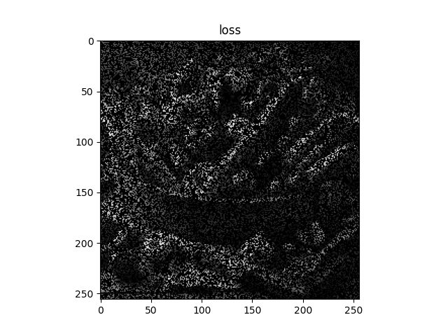

# PDSによる欠損画素補間
- **pds_interpolation_l1norm.py**（欠損画像から滑らかな画像を推定する（L1ノルム））
   - 元画像をグレースケール変換し、欠損を付加する。
   - L1正則化を用いて画像を推定する。

  |                      欠損画像                      |                             欠損画素補完画像                                                           |
  | :------------------------------------------------: | :----------------------------------------------------------------------------------------------------: |
  |  |  |
 
- **pds_interpolation_l2norm.py**（欠損画像から滑らかな画像を推定する（L2ノルム））
   - 元画像をグレースケール変換し、欠損を付加する。
   - L2正則化を用いて画像を推定する。

  |                     欠損画像                       |                                  欠損画素補完画像                                                    |
  | :------------------------------------------------: | :--------------------------------------------------------------------------------------------------: |
  |  |  |

- L1正則化に比べて、L2正則化の方が[グレースケール変換した画像](Images/yasai256gray.png)により近くなる。
- L2正則化は画素値を下げて画像全体をなめらかにする傾向がある。
  これにより、近傍の画素の情報を適切に利用して補間することができる。
- 一方で、L1正則化はスパース性を促進するため、画素値の一部が厳密にゼロになる可能性がある。
  これが補間の品質を低下させる可能性がある。

### PDS vs ADMM (欠損画素補間)
#### L1ノルム

  |                      欠損画素補間画像（ADMM）                                                           |                             欠損画素補間画像（PDS）                                                   |
  | :-----------------------------------------------------------------------------------------------------: | :---------------------------------------------------------------------------------------------------: |
  | | |

  - ADMMとPDSの収束解の誤差：3.505（小数点第4位で四捨五入）
  - 誤差が0以上になった。
  - 本当は1より小さくなってほしかった。

#### L2ノルム

  |                      欠損画素補間画像（ADMM）                                                         |                             欠損画素補間画像（PDS）                                                 |
  | :---------------------------------------------------------------------------------------------------: | :-------------------------------------------------------------------------------------------------: |
  | | |

  - ADMMとPDSの収束解の誤差：0.001（小数点第4位で四捨五入）
  - 誤差がほぼ0に近いことから同じ結果が得られる。
  - ただし、両手法ともメリット、デメリットが存在する。

#### PDSメリット
- 逆行列計算を必要としない
- 計算する変数が少ない

#### PDSデメリット
- ステップサイズが複数あり、設定が難しい
- 収束が遅いことがある

#### ADMMメリット
- 収束が速い（比較的早く最適解まで行く）
- ステップサイズが1つだけであるので、設定が比較的容易

#### ADMMデメリット
- 逆行列計算を必要とする
- 計算する変数が多い