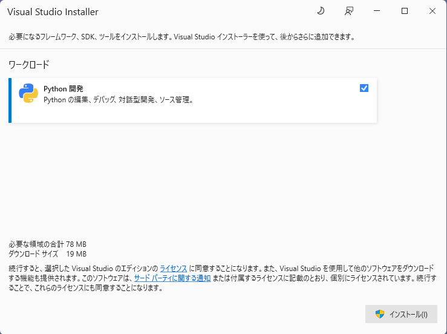
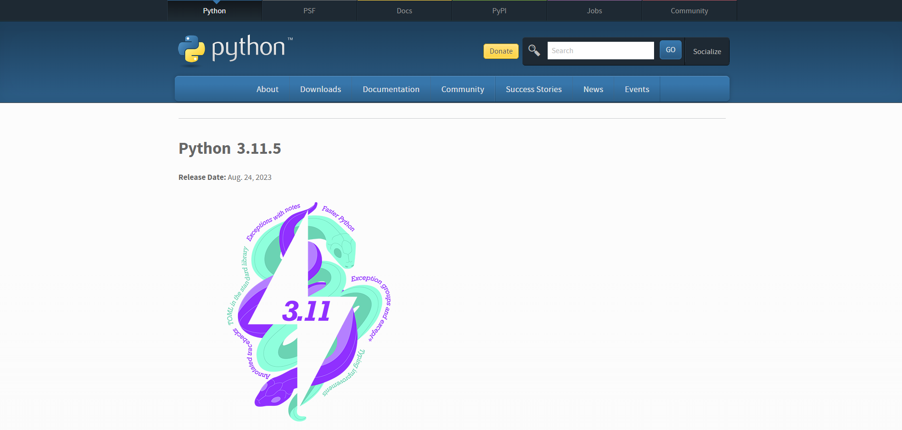
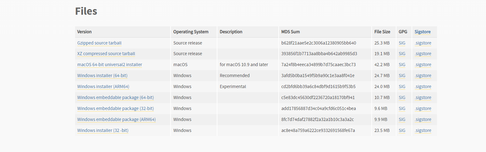
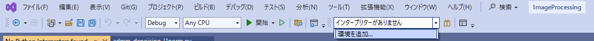
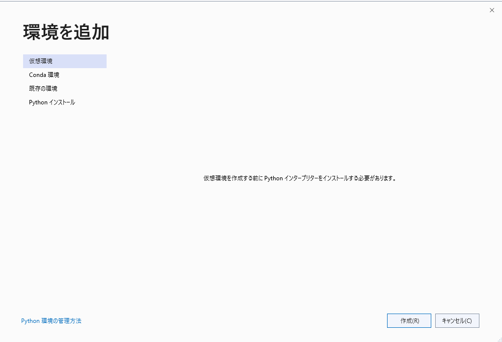
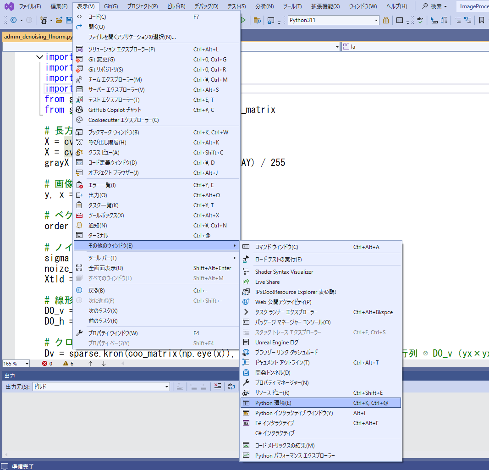
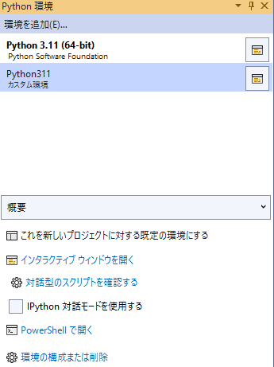
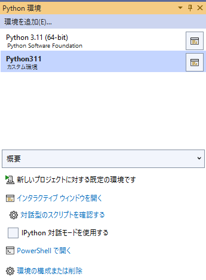
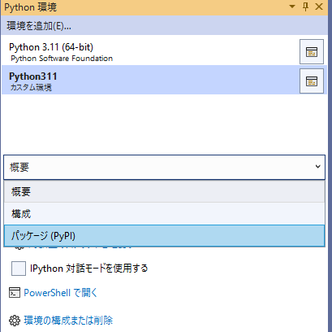
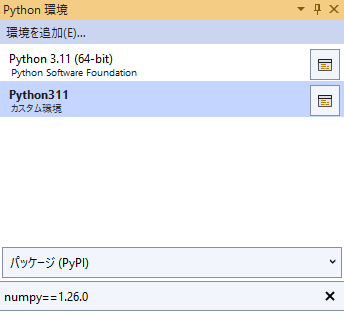

# ImageProcessing

画像処理に関して学んだことを実装していきます。

# 目次
- [エッジ検出](Documentation/EdgeFilter.md)
- [最小二乗法によるノイズ除去](Documentation/LSM_Denoising.md)
- [最小二乗法による欠損画素補間](Documentation/LSM_MissingPixelInterpolation.md)
- [ADMMによるノイズ除去](Documentation/ADMM_Denoising.md)
- [ADMMによる欠損画素補間](Documentation/ADMM_MissingPixelInterpolation.md)
- [PDSによるノイズ除去](Documentation/PDS_Denoising.md)
- [PDSによる欠損画素補間](Documentation/PDS_MissingPixelInterpolation.md)

# 環境構築
### Visual Studio 2022 のセットアップ
**Visual Studio 2022** を公式ページからダウンロードする
- [公式ページ](https://visualstudio.microsoft.com/ja/)  

ダウンロードしたインストーラー(**VisualStudioSetup.exe**)を実行する  
**Visual Studio Installer** が開くので**Python開発**を有効にして、インストールする  

### Python 環境のセットアップ
**Python 3.11.5** を公式ページからダウンロードする
- [公式ページ](https://www.python.org/downloads/release/python-3115/)  

下にスクロールし、**Files->Windows installer(64-bit)** をダウンロードする

ダウンロードしたインストーラー(**python-3.11.5-amd64.exe**)を実行する  
**python-3.11.5(64-bit)Setup** が開くので、**Install Now** をクリック  

インストールが終わったら、Visual Studio 2022 に環境を追加する 

共有したフォルダにある **ImageProcessing.zip** を展開し sln ファイルを開く  
**「インタープリターがありません」** の右横にある **▼** をクリックして **「環境を追加」** をクリックする

ウィンドウが表示されたら、 **「既存の環境」** をクリックする  

**環境タブ** を **カスタム** に変更する  
**プレフィックスパスタブ** を **インタープリターのパス** に設定する  
- 手順通りなら、**「C:\Users\ユーザーフォルダ名\AppData\Local\Programs\Python\Python311」** を設定する  

**追加** をクリックする  

これでPython環境が追加されるので、この環境にパッケージを追加する

**メニューバー→表示→その他ウィンドウ→Python環境** をクリックする

ソリューションエクスプローラーの隣にPython環境が追加されているのでクリックする  
**Python311(カスタム環境)** をクリックし、 **「これを新しいプロジェクトに対する規定の環境にする」** をクリックする  

**Python311(カスタム環境)** が太字で表示され、  
**「新しいプロジェクトに対する規定の環境です」** となれば OK  

**概要** と表示されているドロップダウンリストをクリックして、
**パッケージ(PyPI)** に変更する

今回使用するパッケージは以下のもの
- numpy(1.26.0)
- opencv-python(4.9.0.80)
- matplotlib(3.7.1)
- scipy(1.10.1)

**パッケージ(PyPI)** の下に **入力欄** が表示されるので、そこに  
**パッケージ名==バージョン** と入力して Enter キーを押し、  
パッケージをインストールする

これを4つすべてに行う

# プログラムの実行
**py ファイル** を実行したいときは **Source フォルダ** にある **py ファイル** を右クリックして **「スタートアップファイルとして設定」** をクリックする  
**ツールバー→「開始」** をクリックして実行できる